# 🚨 Azure Honeypot & Global Attack Map  
### *Cloud SOC | Threat Telemetry | KQL Detection Engineering*

This project simulates a real-world SOC workflow by deploying a honeypot in Microsoft Azure, capturing attacker traffic, enriching logs with geolocation data, and visualizing live attacks on a world map using an Azure Sentinel workbook.

It demonstrates skills in threat detection, cloud security, log analysis, watchlists, and KQL.

---

---

## ⚙️ Technologies Used
- **Microsoft Azure:** VM, VNet, NSG/Firewalls, Workspace, Azure Sentinel  
- **Kusto Query Language (KQL)**  
- **Azure Workbooks & Watchlists**  
- **Windows Event Logging**  
- **Threat Telemetry & Attack Visualization**  

---

## 🗂️ Project Workflow

### 🔹 **1. Cloud Infrastructure Setup**
- Created a resource group  
- Built a VNet + subnets  
- Deployed a Windows honeypot VM  

### 🔹 **2. Exposing the Honeypot**
- Disabled Windows Firewall  
- Added “Allow Any” rule in NSG  
- Confirmed public internet reachability  

### 🔹 **3. Log Ingestion & Sentinel Integration**
- Added Sentinel to Workspace
- Installed Sentinel agent on VM
- Verified logs flowing into Sentinel  

### 🔹 **4. Threat Detection (KQL)**
- Queried brute-force attempts  
- Extracted attacker IPs  
- Filtered 4625 failed-logins 

### 🔹 **5. Threat Intelligence Enrichment**
- Built a Watchlist mapping IP → Geolocation
- Joined logs with geolocation metadata  

### 🔹 **6. Attack Map Workbook**
- Built a real-time world map  
- Plotted attacker coordinates  
- Visualized global login failures  

---

## 📸 Screenshots

### **Created Resource Group**  
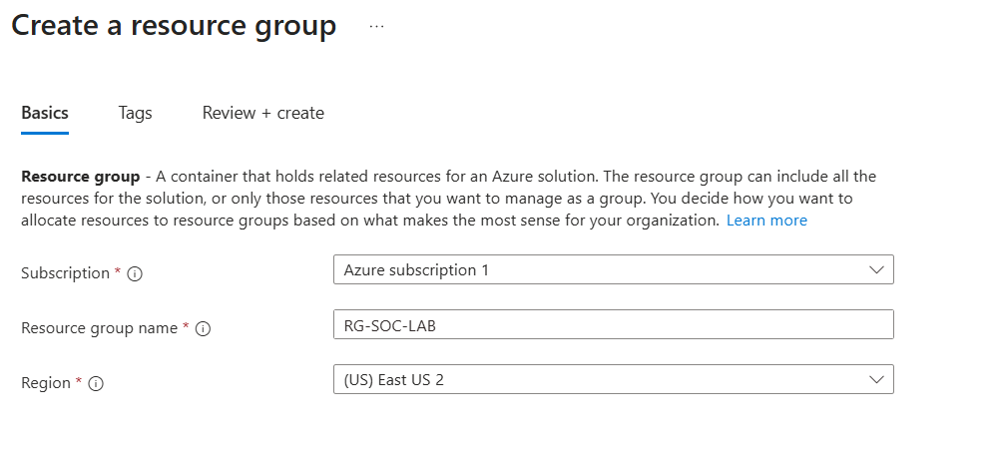

### **Created Virtual Network**  
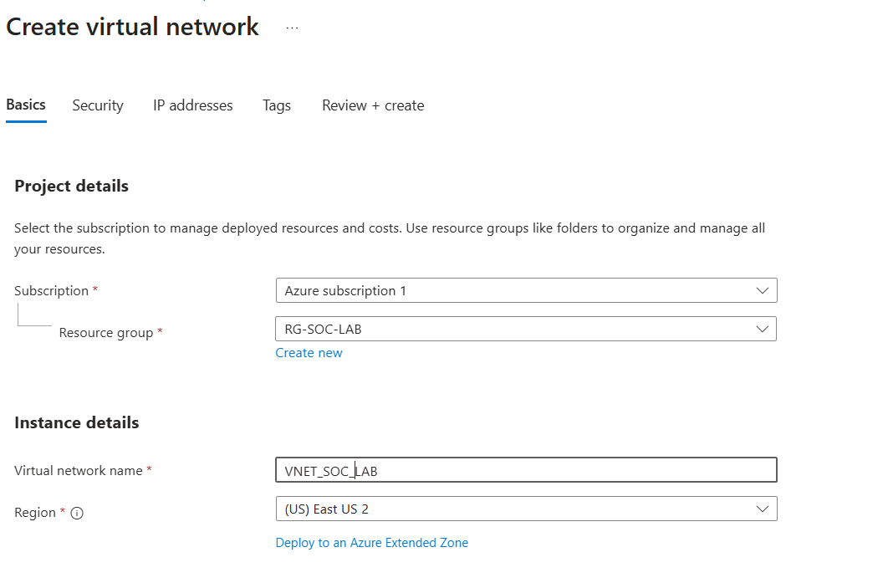

### **Created Honeypot VM**  
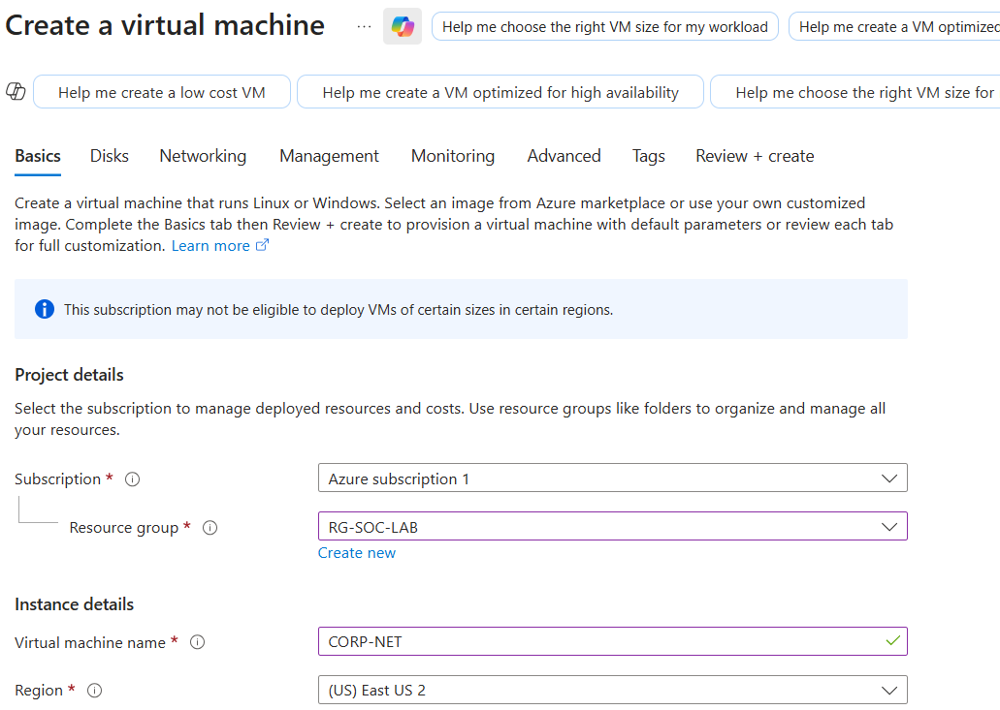

### **Allow Any Rule in NSG**  
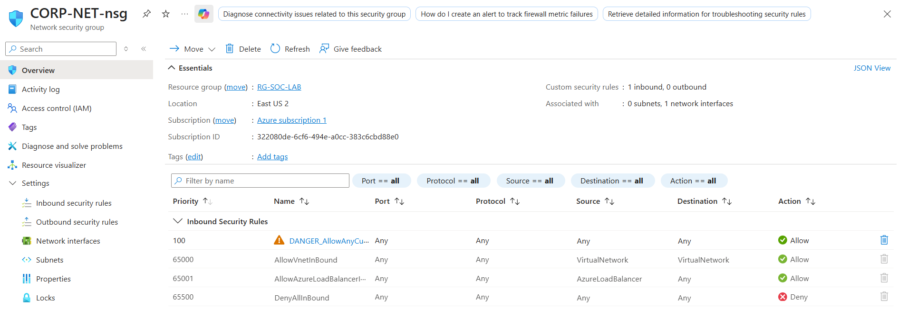

### **Disabled Windows Firewall on Honeypot**  
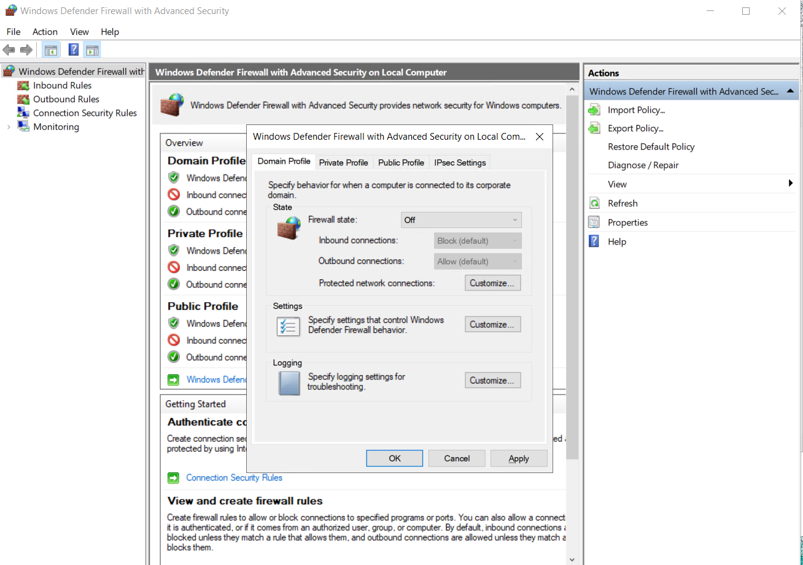

### **Ping: Confirm Public Reachability**  
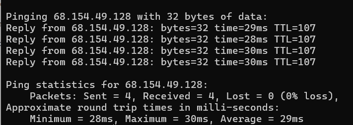

### **Queried Failed Login Attempts**  
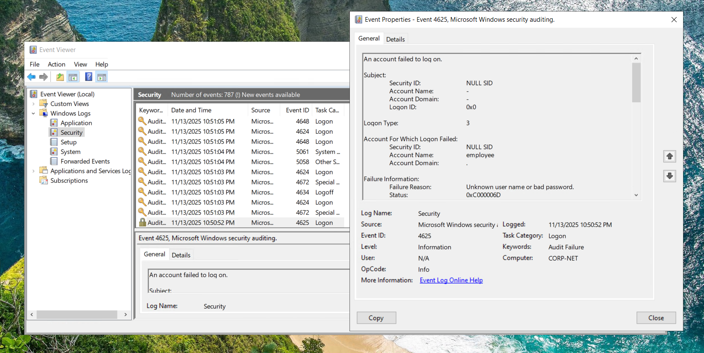

### **Added Sentinel to Workspace**  
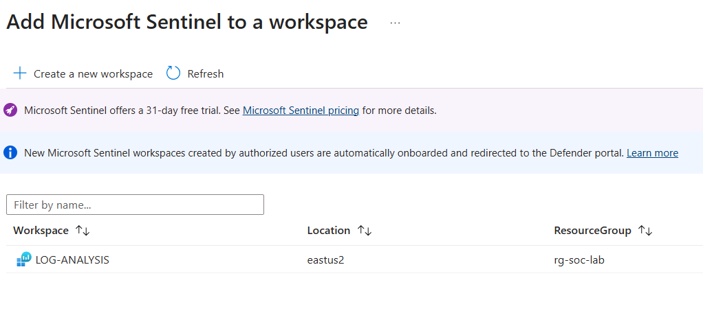

### **Installed Sentinel Agent**  
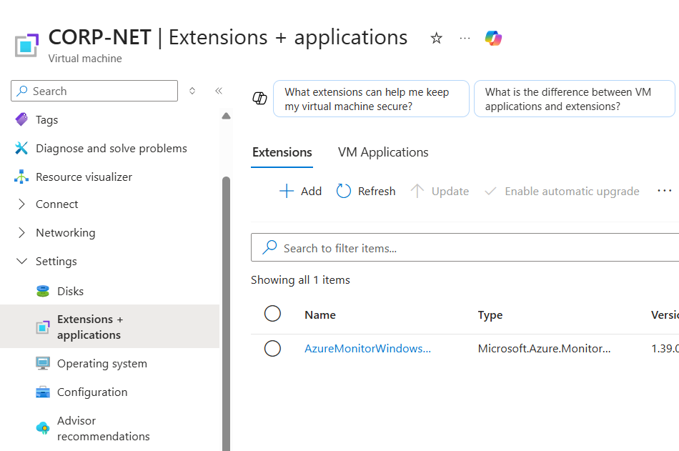

### **Filtered Logs with KQL**  
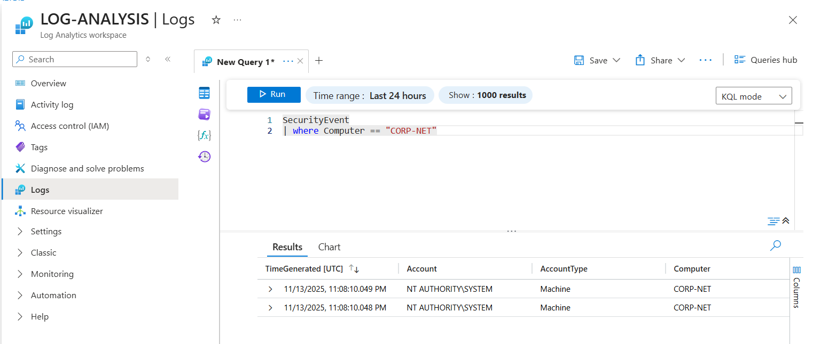

### **Created Watchlist**  
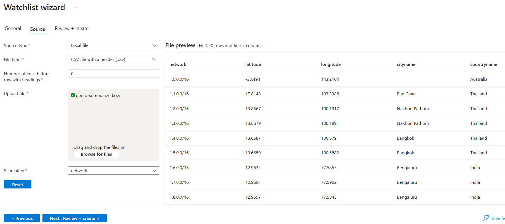

### **Attack Map Workbook**  
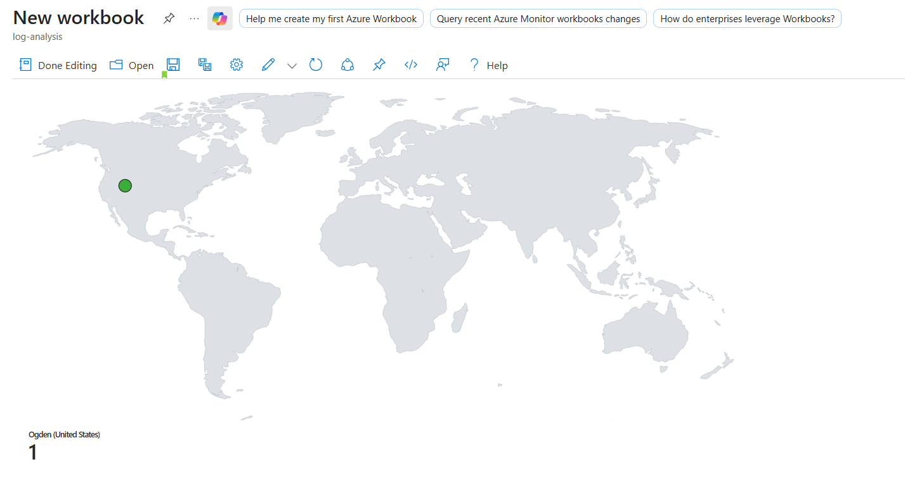

### **Attack Map JSON Configuration**  
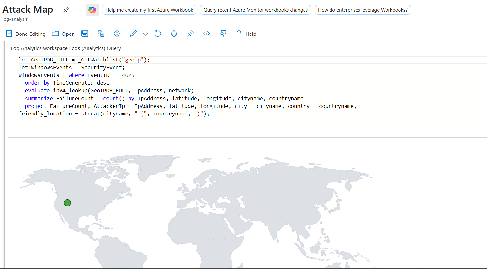

